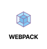
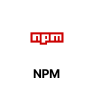

# Олег Кузьмин (Frontend Разработчик)

  

  

  

  

## Технические навыки:

  
  
  
  
  

  
  
  
  
  

  
  
  
    

## Проекты:

### Portfolio https://oleg-kuzmin.github.io/portfolio/

Сайт-лендинг портфолио.

### Next Food Delivery https://next-food-delivery-indol.vercel.app/

E-commerce сайт на Next.js и React для desktop и mobile - сервис доставки еды (5 страниц: главная, корзина, форма, условия доставки, акции).

### Mesto Project https://oleg-kuzmin.github.io/mesto-project/

Сайт-приложение на ООП JavaScript (CRUD) для desktop и mobile. Проект связан с api от яндекса. Похож на аналог instagram с загрузкой карточек красивых мест. Общий стек карточек приходит из api.

### Film Camera Repair https://oleg-kuzmin.github.io/film-camera-repair/

Сайт-лендинг по ремонту фотоаппаратов.

### Russian Travel https://oleg-kuzmin.github.io/russian-travel/

Сайт-лендинг про путешествия.

### How To Learn https://oleg-kuzmin.github.io/how-to-learn/

Учебный сайт-лендинг от Яндекс.
